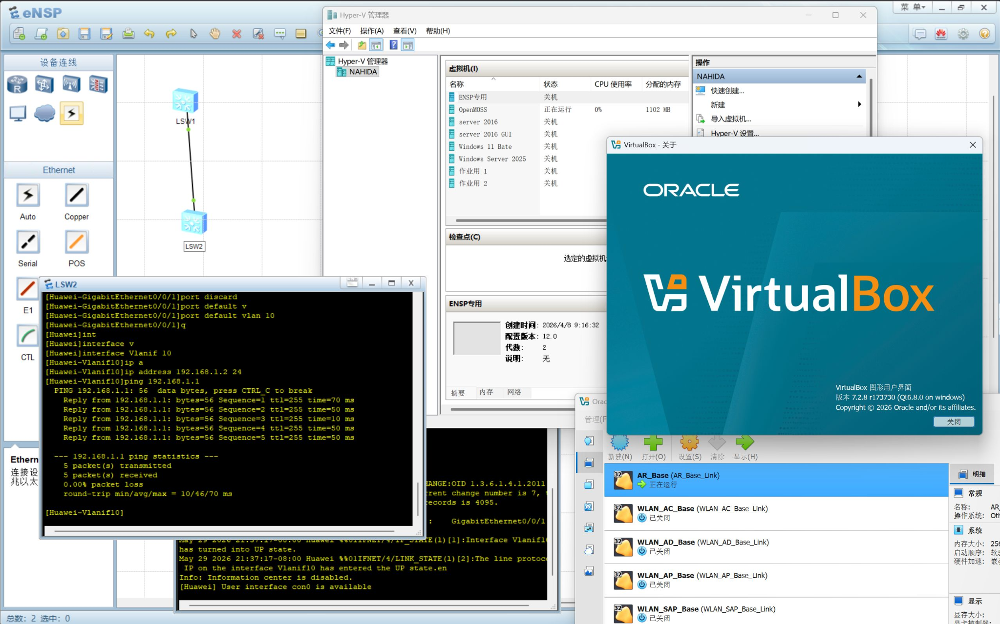

# ensp-vbox-shim

让原版 **华为 eNSP** 直接跑在 **VirtualBox 7.x** 上，底层是真实vbox
7.2.8 虚拟机引擎，全程不降级组件。

> 本工具开源于 https://github.com/LBXaaa/ensp-vbox-shim
> 若是付费获得，则为他人倒卖，请到上述地址免费下载。

## 为什么做这个

我在备考广东省职业技能等级认定《信息通信网络运行管理员》中级工，考试要求在
原版 eNSP 上操作。可我这台机器卡在一对矛盾上：eNSP 依赖的是 VirtualBox
**5.2**，而我日常离不开 WSL2/Hyper-V——只要开着这些虚拟化组件，VBox 5.2 在
现代 Windows（Win11、Win10 24H2 及以上）上**根本装不上**；偏偏这些组件我一个
都关不掉，5.2 这条路就这么堵死了。

网上流传的那些办法——降级 VirtualBox、改注册表、打补丁、换用 eNSP Pro——
大多要么挑系统版本，要么治标不治本，要么和现有环境冲突，要么干脆难以获取，
没一个撑得起稳定备考。

于是我写了这套二进制 COM 垫片：让原版 eNSP 直接运行在 VirtualBox 7.x 上，既不
降级任何组件，也不动本机的 WSL2/Hyper-V——对 eNSP 假装成 5.2，背地里把调用
翻译给真正的 7.2.8。



## 工作原理

三处改动，让 eNSP 把 7.2 当成 5.2：

1. **`VBox52.dll` 垫片**（放进 `eNSP\tools\`）—— 对外呈现 5.2 形状的
   `IVirtualBox` vtable，把每个槽位转发到重映射后的 7.2 方法；eNSP 经
   `GetVBoxInstance()` 或 COM 类厂拿到它。
2. **版本伪装** —— 注册表和进程内都把版本报成 `5.2.x`，放行 eNSP 的版本闸门
   （二进制实为 `7.2.8`）。
3. **`VAR_Plugin.dll` 补丁** —— AR 插件按写死的 5.2 偏移直接调 `IVirtualBox`，
   一个 28 站点的可逆补丁把偏移重映射到 7.2。

```
eNSP_Client.exe → eNSP_VBoxServer.exe → VBox52.dll (垫片) → VBoxSVC.exe 7.2.8
```

细节见 [架构](docs/architecture.md)、[vtable 映射表](docs/vtable-mapping.md)、[组件清单](docs/manifest.md)。

## 关于启动速度

因为本机开着 WSL2/Hyper-V，VirtualBox 7.x 没法直接用 VT-x 硬件加速，只能跑在
Hyper-V 之上。代价是**网络设备启动明显变
慢**：单台 AR/AC 等设备从点“开始”到完全起来，**3-5 分钟属正常**，请耐心等待，
不是卡死。这是开启虚拟化组件后的固有代价，与本垫片无关——纯净（未开虚拟化）的
机器上会快得多，但那种机器本就能直接装 VBox 5.2，也就用不到这套垫片了。

> 注：若把整套环境跑在**虚拟机里**（宿主机 Hyper-V + 客户机 eNSP，三层嵌套），
> 设备可能显示"正在运行"却出不来进度条。这是嵌套虚拟化的已知限制，解决办法见
> [installer/README.md 的"已知限制:嵌套虚拟化"](installer/README.md)。物理机不受影响。
>
> 注：**Windows Sandbox / WDAG 不受支持**，设备会报"错误 40"。沙箱用 VSMB 共享挂载系统盘，
> 与 VirtualBox 进程加固对系统 DLL 加载路径的校验冲突，VM 进程在启动阶段即被加固终止——
> 这是 Windows Sandbox 与 VirtualBox 的固有冲突，非本垫片可修复（原版 VBox 在沙箱内同样起不来）。
> 请改用普通虚拟机或物理机。

## 仓库结构

| 目录 | 内容 |
|------|------|
| [`installer/`](installer/) | **一键整合包**源文件：双击 `安装.bat` 自动检测路径、打补丁并注册基础设备 VM(打包好的 zip 见 [Releases](../../releases)) |
| [`src/`](src/)         | 垫片源码：`vbox52_proxy.cpp`、`vbox52_thunks.asm`、`spoof_thunks.cpp`、`imachine_entries.asm`、`vbox52.def` |
| [`build/`](build/)     | `build.bat`（32 位 MSVC）和我们预编译好的 `VBox52.dll` |
| [`patches/`](patches/) | `patch_var_plugin.py` 及 AR 插件补丁的规格说明 |
| [`registry/`](registry/) | `.reg` 文件：版本伪装、CLSID 劫持、卸载 |
| [`docs/`](docs/)       | 架构、vtable 映射、承重件清单 |
| [`analysis/`](analysis/) | 支撑这一切的逆向脚本与发现 |

## 安装

### 一键整合包(推荐)

推荐使用整合包一键安装,前往 **[Releases](../../releases)** 下载最新的整合包 zip:

1. 先装好原版 eNSP 和官方 VirtualBox 7.2.x;
2. 下载并解压整合包 zip;
3. 双击 **`安装.bat`**,UAC 弹窗点"是";
4. 它分两步:第 1 步打补丁(自动检测 eNSP/VBox 装在哪、拷垫片 DLL、写版本伪装、按真实
   路径生成 CLSID 项、给 AR 插件打补丁),第 2 步自动注册基础设备 VM。全程双击一次、UAC
   只弹一次,无需手动指定路径。

还原:双击 **`卸载.bat`**。只想看当前状态不改动:`install.ps1 -Check`。
整合包里的脚本与说明就是仓库 [`installer/`](installer/) 目录的内容,详见
[installer/README.md](installer/README.md)。

#### 基础 VM 的注册(已自动完成,设备起不来再看)

eNSP 在 VirtualBox 7.x 上**无法自动注册**它的基础设备 VM(`AR_Base`、`WLAN_*_Base`)
——这些是 eNSP 拖设备时的克隆源,没注册上,设备就起不来。`安装.bat` 的第 2 步已用登录账户
身份**自动**做了这件事,正常无需额外操作。

绝大多数情况无需手动注册。只有一种例外:安装时**右键选了"用其他管理员账户运行"**——
这会把注册信息写进那个管理员的配置里,而不是平时启动 eNSP 的登录账户,于是 eNSP 看不到。
出现这种情况时,安装窗口会有黄字提示跳过了注册。

补救:**用平时启动 eNSP 的账户**(不要用管理员)双击 **`注册设备.bat`**。它会扫描
`vboxserver\` 下的基础盘并重新注册一遍,把注册状态恢复正常。这一步幂等、可逆,不会动磁盘文件;
想先看它会做什么而不实际执行,跑 `register_vms.ps1 -Check`。

### 手动安装

想完全掌控每一步,或要自行重新编译,前提:已经装好 **VirtualBox 7.2.x** 和
**华为 eNSP**;自行编译还需要一套 32 位 MSVC 工具链。注册表和 `Program Files`
的改动需要管理员权限。

```bat
:: 1. 垫片 —— 编译（或直接用 build\VBox52.dll）后拷进 eNSP 的全部 4 个加载位置
build\build.bat
copy build\VBox52.dll "C:\Program Files\Huawei\eNSP\tools\VBox52.dll"
copy build\VBox52.dll "C:\Program Files\Huawei\eNSP\vboxserver\VBox52.dll"
copy build\VBox52.dll "C:\Program Files\Huawei\eNSP\VBox52.dll"
copy build\VBox52.dll "C:\Program Files\Huawei\eNSP\plugin\ngfw\tools\ngfw\VBox52.dll"

:: 2. 注册表 —— 先版本伪装，再 CLSID 劫持
reg import registry\01_version_spoof.reg
reg import registry\02_clsid_inprocserver.reg

:: 3. AR 插件补丁（会先写一份 .bak）
python patches\patch_var_plugin.py "C:\Program Files\Huawei\eNSP\plugin\ar1000v\VAR_Plugin.dll"

:: 4. x86 VC++ 运行时 —— 拷进 VBox 的 x86\ 子目录（干净机普遍缺，缺则 error 40 / 0x800700C1）
copy installer\payload\msvcrt-x86\VCRUNTIME140.dll "C:\Program Files\Oracle\VirtualBox\x86\VCRUNTIME140.dll"
copy installer\payload\msvcrt-x86\MSVCP140.dll     "C:\Program Files\Oracle\VirtualBox\x86\MSVCP140.dll"

:: 5. 授权 —— 给登录用户对 vboxserver\ 的修改权（否则非提权 VBoxHeadless 建不出 Logs\ → error 40）
icacls "C:\Program Files\Huawei\eNSP\vboxserver" /grant "%USERNAME%:(OI)(CI)M" /T /C /Q
```

第 1、3 步对应整合包脚本里覆盖全部加载位置与打补丁的动作;第 4、5 步是干净机上的承重步骤(整合包 `安装.bat` 会自动做)。装完还要**注册基础设备 VM**(`AR_Base`、`WLAN_*_Base`)——见 [installer/README.md](installer/README.md) 的注册说明,或用平时启动 eNSP 的账户跑 `installer\register_vms.ps1`。

然后启动 eNSP，拉起一台设备即可。要还原，见
[registry/README.md](registry/README.md) 以及
`python patches\patch_var_plugin.py --restore …`。

## 仓库包含与不包含的内容

本仓库仅包含原创内容：垫片源码、补丁器、`.reg` 文件，以及由我们自行编译的
`VBox52.dll`；**不**含任何华为或 Oracle 的二进制文件。补丁器对**已安装**的
副本执行就地修改，且完全可逆（已通过哈希往返校验）。

## 法务说明

本项目与 **华为 eNSP** 和 **Oracle VM VirtualBox** 互操作，二者均归各自所有者
所有；本仓库不重新分发其中任何一方的二进制文件。下面的开源许可只覆盖本仓库里
我们原创的代码（垫片源码、补丁器、注册表文件和分析脚本）。

## 许可证

我们的代码采用 **Mozilla Public License 2.0（MPL-2.0）** —— 见
[LICENSE](LICENSE)。VirtualBox 与 eNSP 归各自所有者所有；本项目与它们互操作，
但不重新分发任何一方。
